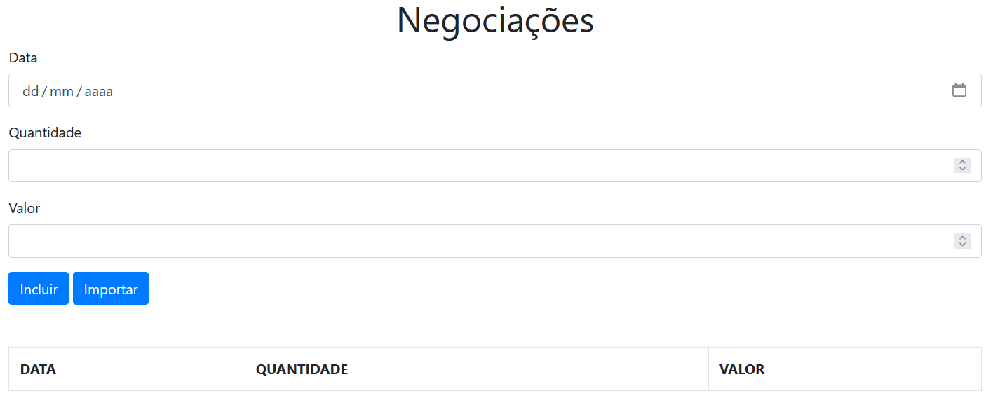
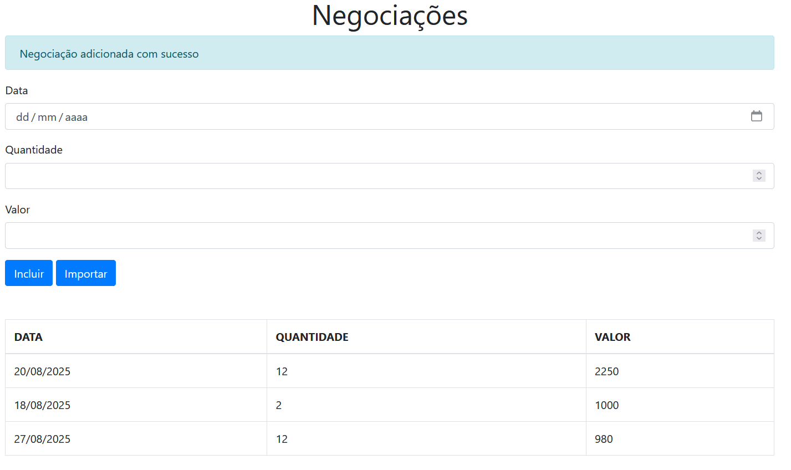
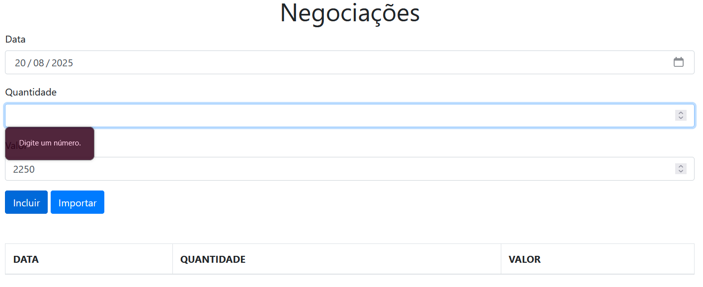

## 📈 Negociações

O **Negociações** é uma aplicação de registro de operações financeiras em **TypeScript**, agora avançada com **técnicas e boas práticas**.

 

## 🚀 Sobre o Projeto

Este projeto foi desenvolvido durante o curso da Alura:

* "TypeScript parte 3: mais técnicas e boas práticas"

Aqui, houve a combinação de tudo o que foi aprendido: **decorators, interfaces, polimorfismo, source maps e integração com API REST**, elevando o Negociações a um mini-framework de gestão financeira.

## 📚 Objetivos do Curso

* Conhecer as vantagens do uso de **Decorators**;
* Criar diferentes tipos de decorators e deixar o código ainda mais elegante;
* Compreender os benefícios do uso de **interfaces**;
* Aprender a organizar e a adicionar **tipo** ao código ao consumir uma **API REST**;
* Entender o papel de **sourceMaps** e aprender como **debugar** a aplicação no navegador;
* Criar soluções combinando tudo o que foi aprendido nos módulos anteriores;
* Tirar benefício do **Polimorfismo** garantindo um código protegido e dinâmico.
  
## 🛠️ Tecnologias Utilizadas

## 🖼️ Visualização do Projeto

Uma prévia das principais funcionalidades do **Negociações**:

**📝 Formulário de Inserção**

Campos para data, quantidade e valor, com botão “Incluir” e "Importar". 

**📊 Lista de Negociações**

Tabela mostrando todas as negociações válidas, atualizada automaticamente.

**⚠️ Mensagem de Validação**

Tentativa de envio com campos faltando dispara alertas personalizados.

 
 
